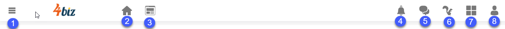
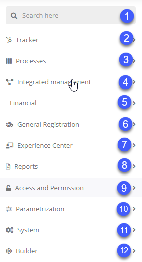
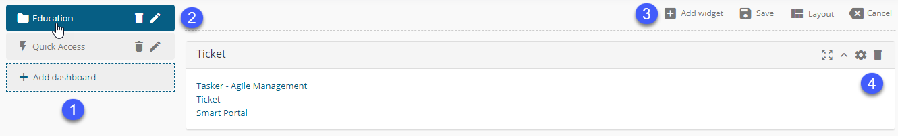

Title: Navigation and user interface
# Navigation and user interface

The user interface is the primary way to interact with products, features and information in a 4biz instance. 

1. Taskbar: in the upper area of the system, the taskbar contains navigation items and tools, such as:

    •	The main menu with all 4biz functionality;
    •	Experience Center;
    •	Notifications;
    •	Chat;
    •	The virtual assistant Helper;
    •	The Quick Access menu;
    •	Information about the user's profile.

2. Navigation menu: the left side menu gives access to:

    •	All 4biz certified processes;
    •	Basic registration features;
    •	Creating and issuing reports;
    •	System parameters;
    •	Access to the 4biz Builder application engine;
    •	Additional 4biz management features.

3. Smart Decisions panel: Provides shortcuts to available features, processes, Smart Decisions reports and widgets.

## User Interface Tour

### Taskbar

The taskbar, located at the top, contains navigation items and tools:

1.	navigation menu, containing all 4biz processes and features.
2.	shortcut to the main screen Home.
3.	shortcut to the Experience Center.
4.	system notifications to the user with the number of unread items.
5.	chat available to service group agents.
6.	access to the virtual assistant Helper.
7.	quick access menu for the main system applications.
8.	user profile menu. It is possible to change the user's data and the system language, manage the status in the chat, the support contacts for 4biz and information about the system version.

### Navigation menu

1.	the feature's search bar;
2.	settings for workflows;
3.	all processes supported on the 4biz Platform;
4.	integrated management features that assist in the management of processes;
5.	basic 4biz registrations, such as users and locations. You can also register and edit menus within the system;
6.	management of the Experience Center. A customizable portal for users;
7.	configuration of several types of reports that can be generated with data from the main functionalities;
8.	configuration of access and permissions;
9.	configuration of application and system parameters;
10.	4biz Platform administration features;
11.	access to the 4biz Builder application engine.

### User Panel (Smart Decision)

The Smart Decision panel is displayed on the system's home page. It organizes a set of dashboards with quick access to links, reports and widgets.

Widgets are components that can be included and used in different areas of 4biz. They are usually used to simplify actions or display information.

1.	vertical bar containing registered dashboards. The bar elements can be reordered to suit the user's needs;
2.	components to edit a dashboard;
3.	components for editing widgets on a dashboard;
4.	example of a Link type widget. Links can be internal and external.

!!! tip "About"

    <b>Product/Version:</b> 4biz | Helium &nbsp;&nbsp;
    <b>Updated:</b>11/03/2020

