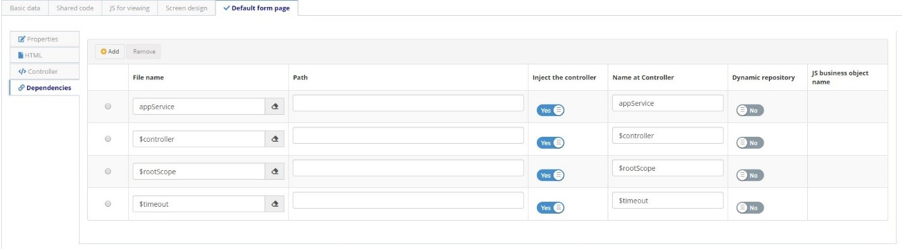

Title: Builder Elements

# Builder Elements

A Builder application is built with a combination of the following elements.

## Business Object

Business Objects are Builder abstractions to application data entities. Each Business Object represents the data model and is linked to a table or a view in a relational database.

## Form

A Builder Form is the way how users interact with the application, executing operations for creating, reading, updating, or deleting data in a Business Objects, or providing information for flow executions.

## Integration Flow

Integration flows allow you to integrate Builder applications with external systems, whether from the 4Biz environment or from third parties. It is a great option for integration with legacy systems.

## Business Process

A Business Process allows the execution of Integration Flows in a periodical and automated way.
Interaction between Builder elements.

In a simple term, we can define the interaction between elements as:

1.	Business Object interacts directly with Forms and external systems (via REST API), making use of Domains and Business Rules for data validation;

2.	Forms interact natively with Business Objects and external systems, using JavaScript / AngularJS programming. User interfaces and business rules applied to Forms can be enriched using shared resources such as JavaScript, CSS and HTML code;

3.	Forms also connect to Integration Flows to interface with legacy systems and databases, and to and ITSM Flows in interface with 4Biz Ticket Management.

