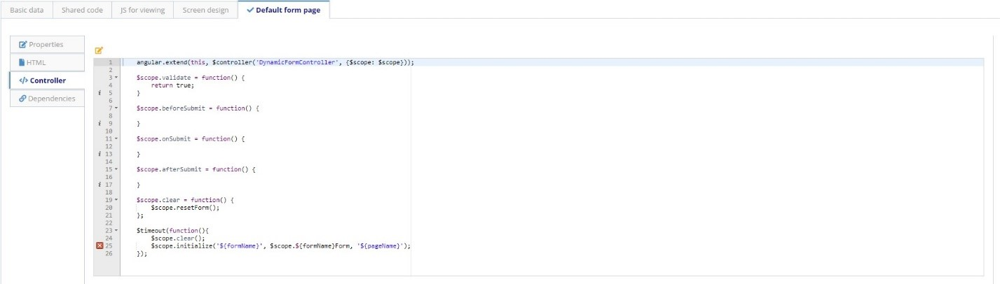

title: Form
Description: Form
# Form

Form is the user interface. It is built by combining drag and drop UI components, CSS resources and JavaScript and AngularJS code.

## Characteristics

- Each Form can contain one or more form pages where each page has HTML code, an AngularJS controller and a collection of dependencies;

- The screen layout is common to all form pages and it is built by dragging and dropping UI components;

- The screen layout, drawn on the Design tab of the screen, contains a collection of lines where each line can have one or more user interface components;

- Form Pages available in the system:

    - **CRUD page** - Page automatically configured by the system during the creation of the Business Object that provides the CRUD (create, read, update and delete) functionality to the Business Object;

    - **Default page** - Page used to provide user data during a 4Biz Service Management service request creation;

    - **Process page** - Page used to start a Builder Business Process;

    - **Task page **- Page to render a Builder form on the ticket screen of a 4Biz Tracker Workflow;

    - **Report page** - Page for integration of Form with reports generated by the system, including specific dependencies for the execution of a JASPER report.

## Before getting started

The Builder Application must have been created.

**Procedure**

1.	Access the form creation functionality through navigation in the menu Builder > Management > Form;

2.	Click on the "New" button;

3.	Fill in the information for “ID” tab:

    - Builder Application to which the form belongs;
    - Form Name;
    - Form Description;
    - Business Rules for data validation, if necessary;
    - Folder where the form configuration should be stored.

    

    Figure 1 - Form

    !!! Abstract "ATTENTION"

       The version number of the form is automatically incremented by the system whenever a new version of the form is saved.

4. Add page

    

    Figure 2 - Add page
    

5. The generated tabs will have the following structure:

    * Properties: General data

    

    Figure 3 - General data
    

    * HTML: page HTML structure

    

    Figure 4 - HTML
    

    * Controller code for the form

    

    Figure 5 - Controller
    

    - Dependencies: If the form needs external code, that code must be registered as a dependency. The name of the dependency, the path in which it is located and whether it should be injected into the controller must also be informed.

    

    Figure 6 - Dependencies

6. Design the screen on the Screen design tab:
    * Drag the components located on the left side palette and drop them in the center of the screen. Components are organized into rows and columns, each row having a width of 12 columns;

    * You can create tabs for the forms. To do this, go to the tab menu and choose the tabs in the horizontal or vertical arrangement. Drag and drop components ifor the tabs as explained above.

    

    Figure 7 - Design

7.	Click the "Save" button. You can save the form in the current version or in a new version.

!!! Abstract "Code to test"
    
    In this tab, you can add variables to test the controller JavaScript code. More information can be found at Developing applications.

!!! tip "About"

    <b>Product/Version:</b> 4biz | Helium &nbsp;&nbsp;
    <b>Updated:</b>11/03/2020 
