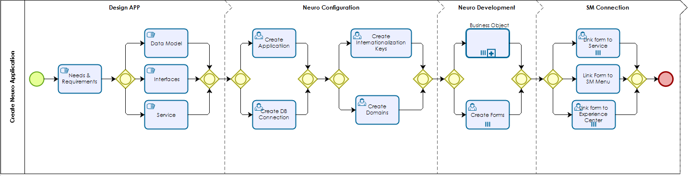
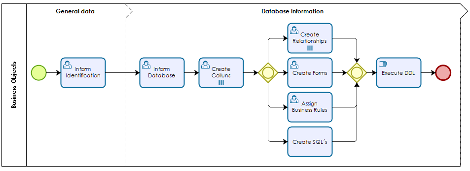

title: Steps to Implement Builder Solution
Description: Steps to Implement Builder Solution
# Steps to Implement Builder Solution

Figure 1 - Create Builder Application

Figure 2 - Business Objects

!!! Abstract "ATTENTION"

    The steps can be found in the 4biz documentation (docs.run2biz.com).

## Design the Application

When creating Builder applications, it is a good practice to start with understanding **business and process needs**, defining **application requirements** and designing the **data model for all data entities** that will be used.

In addition, it is important to identify all desired **interfaces** with 4Biz elements and external systems and list all **services** that require automation.

## Builder Configuration

After designing your application, it is time to create and configure the main Builder components:

1.	Create a new *DATABASE CONNECTION* (if you are not using a pre-existing one) and create your new *BUILDER APPLICATION* entry;

2.	Create any system level *DOMAIN* for your installation should the dozen ones available not do suit your needs;

3.	If the labels of your application forms are to be presented in multiple languages, create any needed *INTERNATIONALIZATION KEYS* in addition to the ones already in Builder by default.

## Builder Development

After finishing the configuration step, you are ready to start developing application. As a general rule you need to:

1.	Create the *BUSINESS OBJECTS*, that will contain the data structure of the data entities.  Here you will create database tables and the relationships among them, write customized SQL queries (if needed) and build grid templates for accessing register in the tables;

2.	Using drag and drop feature, create *FORMS* that will provide the means to the users input, modify and delete information in an user-friendly manner;

3.	If needed, create *BUSINESS RULES* for the validation of the information to be stores into the Business Objects.

## Connect Builder

After you have your Business Objects,  Forms and Business Rules created and configured you can:

1.	Attach Forms to Services as needed;

2.	Make Forms available to 4Biz Experience Center or Smart Portal.

!!! tip "About"

    <b>Product/Version:</b> 4biz | Helium &nbsp;&nbsp;
    <b>Updated:</b>11/03/2020 
