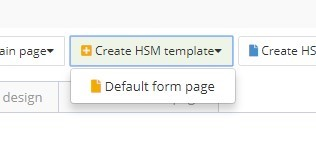
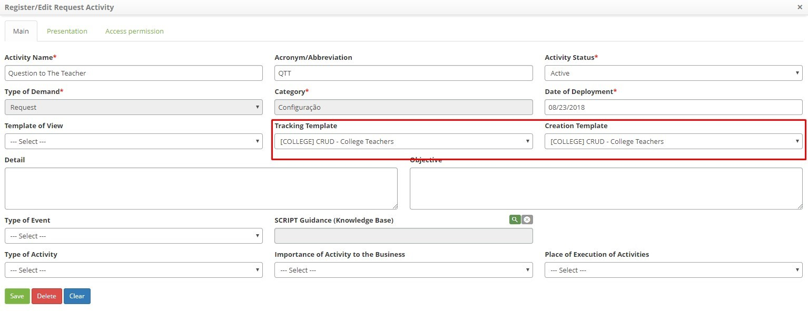
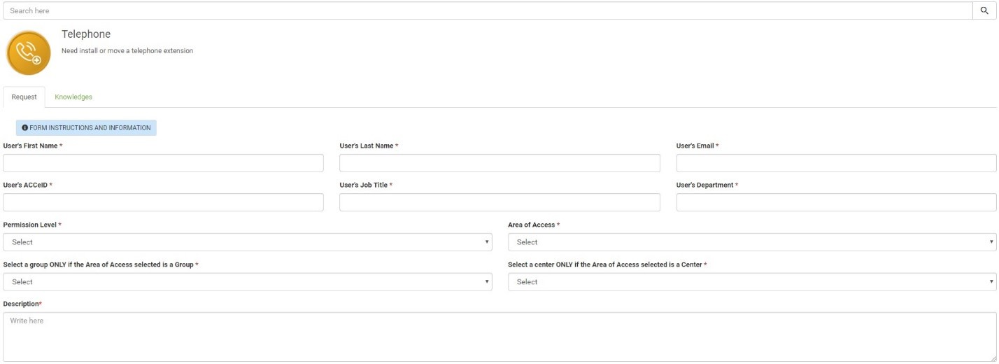
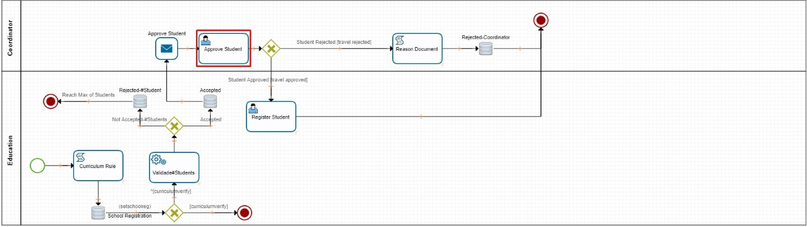
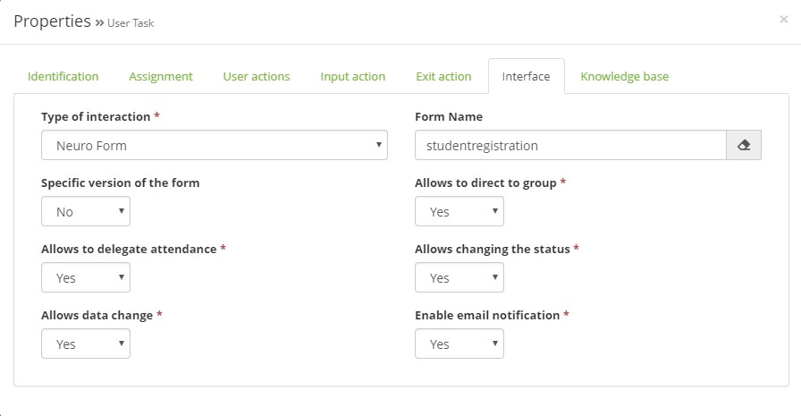

title: Use Builder functionalities in Tickets
Description: Use Builder functionalities in Tickets

# Use Builder functionalities in Tickets

There are two ways to use Builder forms in Tickets:

1.	To insert a **form in a service request**:

   a)  Create a new Builder form or edit an existing one;

   b) Click on the “Create portfolio template” button and select the type of page;
    
 

   c)  Link the template to a request/Incident;

     
   d)  The template will be inserted in the request/incident service request screen.
    

    

2.  To **use a form during the resolution (steps) of a process flow** in the request/incident:

   a)  Select a User Task.]

    
   b)  Link the form to an ITSM Flow step in the “Interface” tab of a User Task.
    
 
    

!!! tip "About"

    <b>Product/Version:</b> 4biz | Helium &nbsp;&nbsp;
    <b>Updated:</b>11/03/2020

