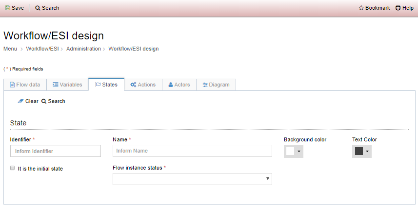
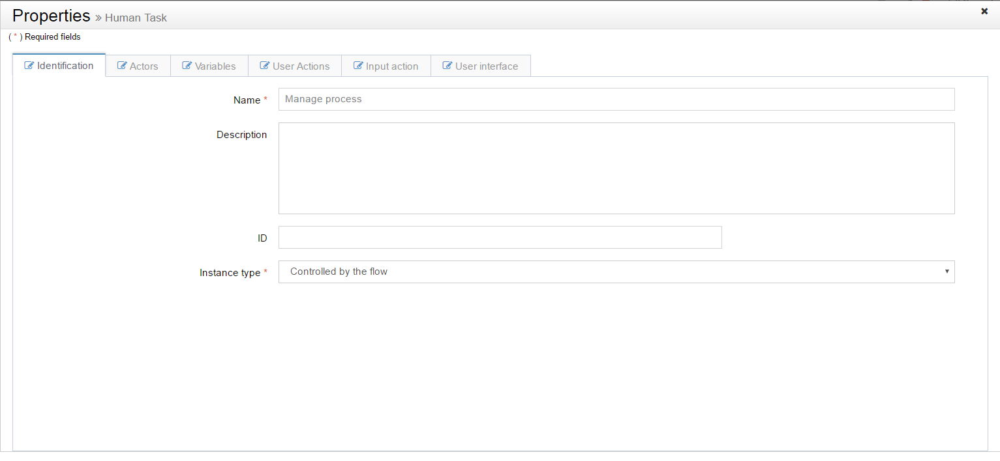

Title: Flujo de integración de procesos  
Description: Los flujos de integración de procesos son trackers que tienen tareas ejecutadas por usuarios, pudiendo también poseer tareas automáticas ejecutadas por el sistema.  

# Flujo de integración de procesos  

Los flujos de integración de procesos son trackers que tienen tareas ejecutadas por usuarios, pudiendo también poseer tareas automáticas ejecutadas por el sistema.    

## Cómo acceder  

1- Acceda a la funcionalidad a través del menú Builder > Administración > Flujo de Integración.  

## Condiciones previas 

1- No se aplica.   

## Filtros

1- El siguiente filtro permite al usuario restringir la participación de elementos en el listado estándar de funcionalidad, facilitando la localización de los elementos deseados:   

 - Palabra clave   

   
Figura 1 - Pantalla de búsqueda de diseño de tracker   

## Lista de elementos 

1- Los siguientes campos catastrales están disponibles para el usuario para facilitar la identificación de los elementos deseados en el listado estándar de la funcionalidad: Nombre, Descripción, Aplicación del flujo, Versión y Fecha de bloqueo.   

 
Figura 2 - Pantalla de la lista de diseño del tracker   

## Complete los campos catastrales - datos del flujo

A través de esta pestaña, se definen las informaciones básicas del flujo que será dibujado.   

1- Haga clic en Registrar > Flujo de integración de procesos, como se muestra en la figura siguiente:    

   
Figura 3 - Pantalla de registro del flujo de integración de servicios    

2- Se mostrará la pantalla de registro de Diseño del tracker, precisamente en la pestaña Datos de Flujo, como se muestra en la figura siguiente:     

   
Figura 4 - Pantalla de registro de flujo de integración de servicios - pestaña de datos de flujo    

3- Complete los campos:  
 
-  Introduzca un nombre para el flujo, una descripción, la aplicación del flujo y qué formulario dará inicio al flujo (si se aplica);  

-  El campo de versión se incrementa automáticamente por el sistema cada vez que se crea una nueva versión del flujo de trabajo;  

-  La gestión de tiempo puede ocurrir de las siguientes formas:  

	-   No gestiona: cuando el tiempo no es administrado en el flujo catastrado.  

	-   Definido en el flujo: se utilizará el tiempo registrado en el flujo, pero solamente si no hay tiempo de ejecución 
	    registrado en el proceso de negocio del flujo registrado  

	-   Definido en la ejecución: se utilizará el tiempo registrado en el proceso de negocio.  

## Variables  

Verificar la documentación de Variables.    

## Estados 

Los estados del flujo representan las situaciones en las que un flujo puede encontrarse, de acuerdo con su ciclo de vida.    

1- Para agregar un estado al tracker, seleccione la pestaña Estados y haga clic en "Agregar".   
2- Se presentará la siguiente pantalla de registro de estado:    

   
Figura 5 - Pantalla de registro de flujo de integración de servicios - pestaña de estado   

3- Completar los campos, informando:    

- Un identificador para el estado;    
- El nombre literal del estado;   
- Un color de fondo que se muestra cuando el flujo está en ese estado;  
- El color del texto que se muestra cuando el flujo está en ese estado;   
- Si es el estado inicial del flujo;    
- La situación de la instancia del flujo, es decir, si en ese estado el tracker estará abierto, cerrado, suspendido o cancelado.   

4- Para editar un estado, seleccione el estado deseado, haga clic en "Editar", haga los cambios necesarios y haga clic en "Actualizar" para completar la edición.

5- Para eliminar un estado, seleccione el estado deseado, haga clic en "Eliminar" y confirme la eliminación.   

!!! Abstract "ATENCIÓN"  

    Para guardar efectivamente los cambios, haga clic en "Guardar" en la barra superior. 
	
## Acciones

Por medio de este menú, es posible registrar las acciones que serán ejecutadas en el tracker.     

1- Para incluir una acción, seleccione la pestaña Acciones y haga clic en la opción "Agregar".  
2- Se mostrará la pantalla de registro de acción, como se muestra en la figura siguiente:   

  
Figura 6 - Pantalla de registro/edición del tracker, pestaña de acciones   

3- Completar los campos, informando:    

- Un identificador para la acción;  
- Su nombre literal;  
- El estado final que será establecido después de la ejecución de la acción (previamente registrado en la pestaña Estados);   
- Si la acción requiere o no un motivo.   

4- Además, se puede definir un script para ejecutarse cuando se acciona la acción.    
5- Para editar una acción, seleccione la acción deseada, haga clic en "Editar", realice los cambios necesarios y haga clic en "Actualizar" para completar la edición.  
6- Para eliminar una acción, seleccione la misma, haga clic en "Eliminar" y confirme la eliminación.  

!!! Abstract "ATENCIÓN"  

    Para guardar efectivamente los cambios, haga clic en "Guardar" en la barra superior.  
	
## Actores 

Los actores del flujo son los usuarios o grupos de usuarios que participan en la tarea del tracker diseñado.   

Ejemplo: Suponga que usted desea pedir una pizza de su casa.  En su flujo de pedido de entrega de pizza, probablemente contará con actores como el cliente, el asistente, el pizzaiolo, y el entregador. Todos estos papeles son considerados actores en el flujo, pues todos ellos participan en el proceso de entrega de pizzas.    

1- Para incluir una acción, seleccione la pestaña Actores y haga clic en la opción "Agregar";    
2- Se mostrará la pantalla de registro de acción, como se muestra en la figura siguiente:    
	
 
Figura 7 - Pantalla de registro/edición del tracker, pestaña de Actores    
	
3- Completar los campos, informando:    

- Un nombre para el actor;   
- El tipo de actor;    
- Si es grupo o usuario;  
- El valor inicial del actor, si se aplica.  

4- Los valores iniciales de los actores pueden ser del tipo:  

- Constante;  
- Script;  
- Variable del flujo.  

5- Independiente del tipo de valor inicial, todo el valor definido tendrá que ser un texto, donde:    

- Si el tipo de actor es "Usuario", deberá ser informado el "login" del usuario registrado en el GRP.   
- Si el tipo de actor es "Grupo", deberá ser informado la "sigla" del grupo registrado en el GRP.    

6- Para editar una acción, seleccione la acción deseada, haga clic en "Editar", realice los cambios necesarios y haga clic en Actualizar para completar la edición. 

!!! Abstract "ATENCIÓN"  

    Para guardar efectivamente los cambios, haga clic en "Guardar" en la barra superior.  
	
7- Para eliminar una acción, seleccionéla, haga clic en "Eliminar" y confirme la eliminación.  
	
## Diagrama  

El diseño del tracker se realiza en la pestaña de Diagrama. Todo el proceso de negocio puede ser dibujado por aquí, por medio de la utilización de la notación BPMN.    

1- Los elementos que se pueden agregar al tracker, se encuentran en la paleta en la esquina izquierda de la pantalla. Estos elementos se subdividen en:   

- Eventos: “Son ocurrencias que disparan, interrumpen, cambian o finalizan el proceso. Se clasifican como eventos de inicio, intermediarios o de fin, dependiendo del momento en que ocurran en el proceso”.   
- Tareas: “Es la parte más pequeña de un proceso. Es una acción, no es una función, ni el estado de un producto o servicio. Es "qué" hacer, por eso debe ser escrita con el verbo en el infinitivo".   
- Gateways: “Direccionan el proceso, dividiendo o convergiendo las actividades en el flujo. Normalmente representan un punto de control en el proceso”.  

 
Figura 8 - Pantalla de registro/edición del tracker, pestaña de Diagrama   

2- Para incluir un elemento en el flujo, selecciónelo y arrástrelo a la página de dibujo. Un modo con las propiedades del elemento aparecerá en la pantalla (según el elemento elegido). La información mostrada para completar en el modo, dependerá de acuerdo con el elemento seleccionado, que puede ser:    

**- Para eventos:**  

- Nombre  
- Descripción  
- Expresión CRON (para eventos de temporizador)   
- Objetivo (para eventos de envío de señal)   
- Identificador del objetivo (para eventos de envío de señal)  

**- Para tareas:**  

- Identificación   
	- Nombre    
	- Descripción    
	- Identificación   

3- Variables  
- En esta pestaña deberán seleccionarse las variables registradas que forman parte de la ejecución de esa tarea. Se pueden seleccionar varias variables, siendo que una variable puede ser de entrada y/o salida. Las variables que se presentan en esta lista son las mismas que se han registrado en la pestaña "Variables" del registro del tracker.    

4- Acciones del usuario   
- La pestaña de acciones de usuario representa las acciones que el usuario puede accionar cuando se está ejecutando la tarea en cuestión. Dependiendo de la acción seleccionada, el flujo puede seguir un flujo alternativo, o no. Todo depende del modelado. Las acciones que se presentan en esta lista son las mismas que se registraron en la pestaña "Acciones" del registro del tracker.    

5- Interfaz  

 - Esta pestaña define cómo se mostrará la interfaz gráfica para el usuario al realizar esta tarea, es decir, cómo será la pantalla que funcionará. Se podrán elegir dos caminos:    

     - Construir la pantalla en HTML dentro de esta pestaña; o   
     - Buscar un formulario pre-registrado en el repositorio del proyecto (Builder > Gestión de la aplicación >  Formulario).    

6- Para utilizar un formulario ya creado en el repositorio, marque la opción Formulario del repositorio como "Sí" e introduzca el nombre del formulario.   
7- Si elige utilizar un formulario de repositorio, tendrá la opción de agregar un HTML con información adicional para esta tarea específica. Es muy útil para la reutilización de formularios genéricos, añadiendo información específica de la tarea.    
	
 
Figura 9 - Botón para editar las propiedades de un componente  
	
 
Figura 10 - Modal con las propiedades del elemento se muestra para editar   	
	
	
!!! tip "About"
    <b>Updated:</b>17/01/2019 - João Pelles Junior	
	
