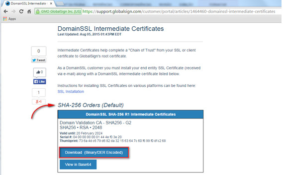
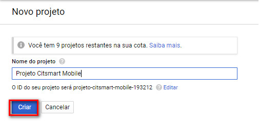
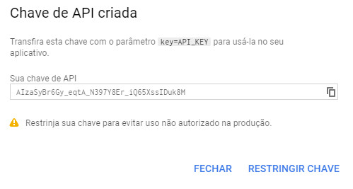
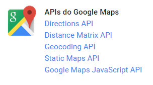
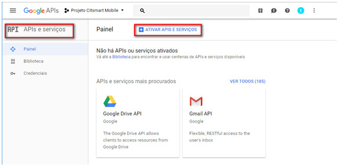
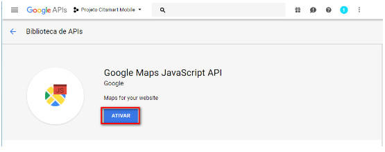

title: Configurar instância 4biz para acesso via mobile
Description: Tem o propósito de fornecer orientações necessárias para configurar o servidor para o uso adequado do 4biz ITSM Enterprise na plataforma iOS e Android.
# Configurar instância 4biz para acesso via mobile

Este documento tem como objetivo orientar para a configuração do servidor para uso do aplicativo 4biz Experience.

Antes de começar
----------------

É necessário Implantar a versão 7.2.2.0 (ou superior) do 4biz, configurar os parâmetros 257 e 272, sendo:

-   Valores: "S" ou "N". Default: "N"

-   Caso o valor do parâmetro seja “S”, poderão ser mostradas somente as
    notificações de solicitações sem responsável atual.

-   Caso o valor do parâmetro seja “N”, poderão ser mostradas as notificações de
    todas as solicitações.

Os parâmetros 254 (Parametrização > Sistema), 255, 256, 258, 267, 284, 285,
286, 350 também devem ser configurados.

Configurando os web services
----------------------------

A configuração dos Web services são fundamentais para o acesso a todas as
funcionalidades do aplicativo. Seguir os passos para melhor configurá-lo:

1.  No 4biz Experience (Web), acessar a funcionalidade de Web Services
    referente ao mobile (Sistema > Configurações > Web Services 4biz
    Mobile);

2.  Clicar na aba “Vincular Grupos” e vincular o grupo executor de atividades aos
    Web Services do 4biz Experience Mobile.

!!! Abstract "Regra"

    No momento que o grupo for selecionado ele será vinculado a todos os Web
    Services do 4biz Experience de forma automatizada.

Instalação do certificado intermediário globalsign
--------------------------------------------------

Para reconhecer o certificado intermediário da GlobalSign (Emissora do
Certificado Digital) é necessário a instalação do mesmo:

1.  Acessar o
    endereço: <https://support.globalsign.com/customer/portal/articles/1464460-domainssl-intermediate-certificates>;

2.  Realizar o download do primeiro certificado, conforme indicado na figura
    abaixo:

    

    Figura 1 - Certificado intermediário da GlobalSign

    *  **No mobile**: informar o nome genérico (sugestão: GlobalSign) e clicar em
       "avançar".

    *  **No desktop**: clicar com botão direito no certificado baixado (conforme figura
       abaixo), clicar em "instalar certificado" e avançar até concluir.

    

    Figura 2 - Instalação do certificado no Windows

3.  Depois de instalado, alterar o endereço do aplicativo para suas
    necessidades.

### Instalação do app Android/iOS

1.  Acessar a loja (Play Store ou App Store) para baixar o aplicativo 4biz
    Experience mobile;

2.  Pesquisar por 4biz Experience e após a pesquisa, selecionar o aplicativo;

3.  Pressionar o botão "Instalar" para baixar o aplicativo.

### Criar chave para uso e consumo das APIs Google

Para que seja possível o uso e consumo das APIs Google é necessário que uma API
Key seja criada. Para isso, os seguintes passos devem ser seguidos:

!!! Abstract "ATENÇÃO"

    Para realizar esses procedimentos é necessário estar logado com uma conta
    Google.

4.  Acessar o console do desenvolvedor
    Google [https://console.developers.google.com](https://console.developers.google.com/);

5.  Clicar em "Criar um projeto", conforme indicado na figura abaixo:

    

    Figura 3 - Console do desenvolvedor Google

6.  Será apresentada uma janela, conforme ilustrada na figura abaixo, para
    informar os dados do novo projeto;

    

    Figura 4 - Tela de criação de projeto

7.  Informar o nome do projeto e clicar no botão "Criar" para criação do projeto.

8.  Após criar o projeto, clicar em APIs e serviços. Para criar a API Key,
    clicar em APIs e serviços > Credenciais > Criar credenciais > Chave de API,
    conforme indicado na figura abaixo:

    

    Figura 5 - Tela de criação de API Key

9.  Feito isso, a chave de API será apresentada:

    

    Figura 6 - Tela de opções de API Key para criação

10. Escolha a opção que melhor atenda a necessidade. Para mais informações sobre qual
    chave irá lhe atender,
    acessar <https://developers.google.com/console/help/new/#generatingdevkeys>.

11.  Após as chaves criadas, as APIs já poderão ser consumidas.

### APIs a serem utilizadas nas soluções

Segue abaixo as APIs do Google a serem consideradas nas soluções:

   

   Figura 7 - APIs

   -   **Directions API**: a API de direções do Google é consumida através de
        requisições HTTP. Tal API calcula direções entre dois pontos informados, a
        origem e o destino, possuindo outras diversas opções. Para maiores
        informações sobre o uso dessa API,
        acesse: <https://developers.google.com/maps/documentation/directions>.

   -   **Distance Matrix API**: a API Google Distance Matrix permite a recuperação
       de matrizes de distâncias entre dois pontos, ou seja, retorna também
       resultado aproximados. A diferença para a Google Directions API é que a
       Distance Matrix não retorna informações tão detalhadas, como os passos a
       serem realizados. Para maiores informações sobre o uso dessa API,
       acesse: <https://developers.google.com/maps/documentation/distancematrix>.

   -   **Geocoding API**: a Google geocoding API é uma API que ajuda a recuperar
       posições geográficas enviando como argumento um endereço por extenso. O
       consume da API é feito por HTTP e os resultados podem ser obtidos em XML ou
       JSON. Para maiores informações sobre o uso dessa API,
       acesse: <https://developers.google.com/maps/documentation/geocoding>.

   -   **Statics Maps API**: a API para mapas estáticos do Google será utilizada em
       casos que não será necessário a interação como mapa, apenas visualização. É
       interessante seu uso uma vez que é mais leve, visto que não é necessário o
       download de recurso JS e imagens que não serão utilizadas. Para maiores
       informações sobre o uso dessa API,
       acesse: <https://developers.google.com/maps/documentation/staticmaps>.

   -   **Google Maps JavaScript API**: o uso da API é feito por meio de uma API JS.
       Para seu uso, basta linkar o JS na página que irá usar o maps. Para maiores
       informações sobre o uso dessa API,
       acesse: <https://developers.google.com/maps/documentation/javascript>.

Ativando uma API
----------------

Para ativar uma API para uso, proceder conforme os passos descritos abaixo:

1.  Após executar os passos descritos na seção "Criar chave para uso e
    consumo das APIs Google";

2.  Clicar em APIs e serviços > Ativar APIs e serviços , conforme indicado na
    figura abaixo:

    

     Figura 8 - APIs Google

3.  Será apresentada a biblioteca de APIs. Selecionar a API que deseja ativar (a
    figura abaixo representa um exemplo de API) e clicar no botão "Ativar"
    conforme indicado na figura abaixo:

    

    Figura 9 - Ativação da APIs Google

4.  Feito isso, a API estará habilitada para uso.

Relacionado
-----------

[Configurar parametrização - mobile](/pt-br/4biz-helium/platform-administration/parameters-list/configuration-parametrization-mobile.html)

[Configurar parametrização - sistema](/pt-br/4biz-helium/platform-administration/parameters-list/configure-parametrization-system.html)

[Manual de utilização do aplicativo mobile 4biz Experience](/pt-br/4biz-helium/additional-features/mobile-and-field-service/apps/4biz-app.html)

[Configurar as opções de menu no mobile](/pt-br/4biz-helium/additional-features/mobile-and-field-service/configuration/configure-mobile-options.html)

!!! tip "About"

    <b>Product/Version:</b> 4biz | Helium &nbsp;&nbsp;
    <b>Updated:</b>11/03/2020

