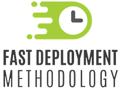

Title: A Metodologia
Description: A Fast Deployment Methodology (FDM) é uma metodologia criada pela 4biz Corporation, desenvolvida para prover a implantação dos produtos 4biz.

Fast Deployment Methodology (FDM)
==================================

O que é FDM?
------------

Fast Deployment Methodology (FDM) é uma metodologia criada pela Run2biz para habilitar uma rápida implementação do 4biz. A FDM foi desenvolvida utilizando técnicas de frameworks como Agile e SCRUM, bem como a experiência prática de nossos especialistas e muitas lições aprendidas.

A FDM está baseada em 2 modelos de informação. O primeiro modelo, chamado de Data Discovery Model, guia os técnicos e analistas envolvidos na implantação do 4biz em uma sequência de quadros e passos que os levarão desde a informação mais básica conhecida até os detalhes organizacionais dos serviços.

O segundo modelo, chamado Product Implementation Model, organiza o relacionamento das informações descobertas na construção do primeiro modelo para que através de sucessão de configurações, o 4biz esteja pronto para ser usado.

A metodologia é constantemente revisada, considerando os resultados obtidos ao final dos projetos, para garantir a sua eficiência, eficácia e praticidade. 

A Run2biz oferece treinamento na metodologia FDM para seus clientes e parceiros através da sua plataforma de treinamento (https://training.run2biz.com/pt-br/index.html).

