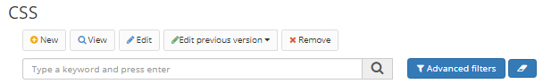

title: CSS  
Description: A apresentação visual dos formulários Builder pode ser customizada através de uso de CSS (Cascading Style Sheets), que são associados aos formulários como dependências (ver a documentação sobre Formulário para mais detalhes sobre dependências).   

# CSS

A apresentação visual dos formulários Builder pode ser customizada através de uso de CSS (Cascading Style Sheets), que são associados aos formulários como dependências (ver a documentação sobre Formulário para mais detalhes sobre dependências).  

## Como acessar    

1. Acesse a funcionalidade através da navegação no menu Builder > Recursos > CSS.  

## Pré-condições    

1.  Não se aplica.  

## Cadastrar um novo CSS

1. Para cadastrar um novo arquivo CSS, clique no botão "Cadastrar”;

      

Figura 1 - Tela de pesquisa de CSS  

2.	Preencha as informações necessárias para Nome, Descrição e Pasta para armazenar o Conteúdo do CSS. Observe que a pasta é usada apenas para fins de organização e não interfere na operação do sistema;

3.	Clique o botão "Salvar".

!!! tip "About"
    <b>Updated:</b>11/03/2020
