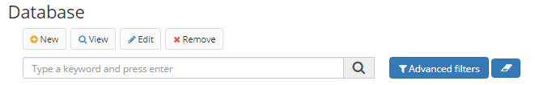

Title: Banco de dados  
Description:Através dessa tela é realizado o cadastro dos bancos de dados que são utilizados pelo Builder.  

# Banco de dados  

Cadastro dos bancos de dados que são utilizados pelo Builder.

## Como acessar    

Acesse a funcionalidade através da navegação no menu Builder > Configuração > Banco de dados.

## Pré-condições  

Não se aplica.  

## Cadastrar um novo banco de dados    

1. Para cadastrar um novo banco de dados que não esteja na lista, clique no botão "Cadastrar”.  
 
   
 
Figura 1 - Tela de pesquisa de banco de dados   

2\.	Preencha as informações necessárias para Tipo de banco de dados, caminho do Driver do banco de dados e Tipos de dados, que são pré-configurados no Builder. Para saber mais sobre o registro de tipos de dados, consulte a documentação relevante.

3\.	Clique no botão "Salvar”.
 

!!! tip "About"
    <b>Updated:</b>11/03/2021
