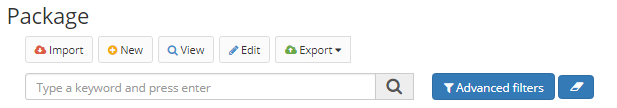

Title: Pacote
Description: Um pacote é uma coleção de artefatos Builder (aplicações, objetos de negócio, formulários, fluxos) que pode ser que pode ser transportada entre ambientes através de exportação e importação.

# Pacote  

Um pacote é uma coleção de artefatos Builder (aplicações, objetos de negócio, formulários, fluxos) que pode ser que pode ser transportada entre ambientes através de exportação e importação.

## Como acessar 

1.	Acesse a funcionalidade através da navegação no menu Builder > Gerenciamento > Pacote.   

## Pré-requisitos 

1. Não se aplica.    

## Gerenciando pacotes

1.	Para cadastrar um novo pacote clique no botão "Cadastrar";

Figura 1 - Tela de pesquisa de pacotes    

2.	Informe o **Nome** e a **Descrição** do pacote. Em seguida, adicione os **Elementos** que farão parte do pacote.

3.	Clique no botão "Salvar" para finalizar o cadastro do pacote e no botão "Pesquisar" para voltar à tela principal;

4.	Para exportar um pacote, selecione o pacote e clique no botão "Exportar". Os pacotes são exportados em formato JSON;

5.	Para importar um pacote, clique no botão "Importar", informe se a versão do pacote a ser importado deverá substituir os elementos que possuírem o mesmo identificador e se a DDL de criação/alteração de Objetos de Negócio deverá ser executada.  Selecione o arquivo referente a um pacote previamente exportado e clique no botão “Importar”.

!!! info "Atenção"
    
    Para garantir a compatibilidade, é recomendável que a versão do Builder que realizará a importação de um pacote seja a mesma versão que realizou a exportação.

!!! tip "About"
    <b>Updated:</b>11/03/2021
