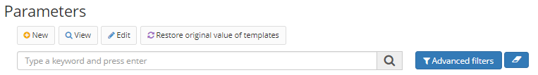

Title: Parâmetros   
Description: Cadastro de parâmetros que são utilizados pelo Builder.    

# Parâmetros  

Cadastro de parâmetros que são utilizados pelo Builder.

## Como acessar 

1.	Acesse a funcionalidade através da navegação no menu Builder > Configuração > Parâmetros.  

## Pré-requisitos  

1. Não se aplica.    

## Cadastrar um novo parâmetro

1.	Para cadastrar um novo parâmetro, clique no botão "Cadastrar.

Figura 1 - Tela de pesquisa de parâmetros    

2.	Preencha o Nome, o Tipo e a Descrição. O sistema apresentará o campo Valor de acordo com o tipo selecionado:

3.	Clique o botão "Salvar”.

!!! tip "About"
    <b>Updated:</b>11/03/2021
