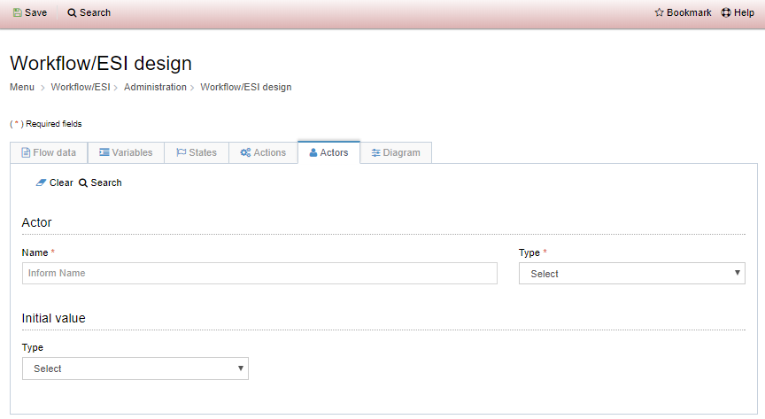
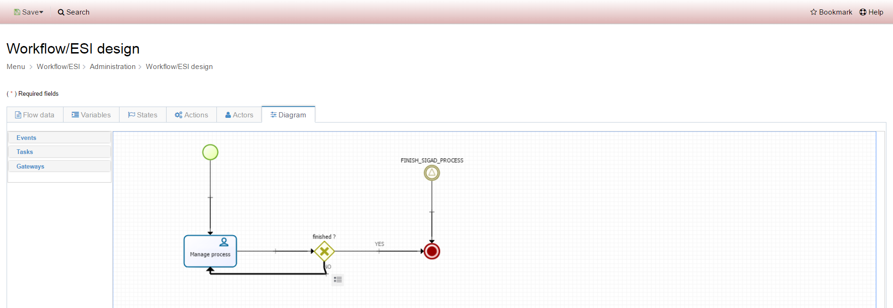

Title: Fluxo de integração de processos  
Description:Os fluxos de integração de processos são trackers que possuem tarefas executadas por usuários, podendo também possuir tarefas automáticas executadas pelo sistema.  

# Fluxo de integração de processos  

Os fluxos de integração de processos são trackers que possuem tarefas executadas por usuários, podendo também possuir tarefas automáticas executadas pelo sistema.    

## Como acessar 

1. Acesse a funcionalidade através do menu Builder > Gerenciamento > Fluxo de Integração.  

## Pré-condições

1. Não se aplica.   

## Filtros

1. O seguinte filtro possibilita ao usuário restringir a participação de itens na listagem padrão da funcionalidade, facilitando a localização dos itens desejados:   

     * Palavra chave   

Figura 1 - Tela de pesquisa de design tracker/ESI   

## Listagem de itens   
1. Os seguintes campos cadastrais estão disponíveis ao usuário para facilitar a identificação dos itens desejados na listagem padrão da funcionalidade: Nome, Descrição, Aplicação do fluxo, Versão e Data de bloqueio.   

 

Figura 2 - Tela de listagem de design tracker/ESI   

## Preenchimento dos campos cadastrais - dados do fluxo 

Através dessa aba, são definidas informações básicas do fluxo que será desenhado.   

1. Clique em Cadastrar > Fluxo de integração de processos, conforme ilustrado na figura abaixo:    

     
    
    Figura 3 - Tela de cadastro de fluxo de integração de serviços    

2. Será apresentada a tela de cadastro de Design tracker/ESI, precisamente na aba Dados de Fluxo, conforme ilustrada na figura abaixo:     

    
    
    Figura 4 - Tela de cadastro de fluxo de integração de serviços - aba dados de fluxo    

3. Preencha os campos:  
 
 * Informe um nome para o fluxo, uma descrição, a aplicação do fluxo e qual formulário dará início ao fluxo (caso se             aplique);  

 * O campo versão é incrementado automaticamente pelo sistema sempre que uma nova versão do tracker for criada;  

 * O gerenciamento de tempo poderá ocorrer das seguintes formas:  

     * Não gerencia: quando o tempo não é gerenciado no fluxo cadastrado;  

     * Definido no fluxo: será utilizado o tempo cadastrado no fluxo, mas somente se não houver tempo de execução                  cadastrado no processo de negócio;  

     * Definido na execução: será utilizado o tempo cadastrado no processo de negócio.  

## Variáveis    

Verificar documentação de Variáveis.    

## Estados 

Os estados do fluxo representam as situações nas quais um fluxo pode se encontrar, de acordo com o seu ciclo de vida.    

1. Para adicionar um estado para o tracker, selecione a aba Estados e clique em "Adicionar".   
2. Será apresentado a seguinte tela de cadastro de estado:    

    
    
    Figura 5 - Tela de cadastro de fluxo de integração de serviços - aba estado   

3. Preencha os campos, informando:    

    - Um identificador para o estado;    
    - O nome literal do estado;   
    - Uma cor de fundo que será exibida quando o fluxo estiver nesse estado;  
    - A cor do texto que será exibida quando o fluxo estiver nesse estado;   
    - Se é o estado inicial do fluxo;    
    - A situação da instância do fluxo, ou seja, se nesse estado o tracker estará aberto, encerrado, suspenso ou cancelado.   

4. Para editar um estado, selecione o estado desejado, clique em "Editar", faça as alterações necessárias e clique em "Atualizar" para concluir a edição.   
5. Para remover um estado, selecione a estado desejado, clique em "Remover" e confirme a exclusão.   

    !!! Abstract "ATENÇÃO"  

        Para salvar efetivamente as alterações, clique em "Salvar" na barra superior.  
	
## Ações

Por meio deste menu, é possível cadastrar as ações que serão executadas no tracker.     

1. Para incluir uma ação, selecione a aba Ações e clique na opção "Adicionar".  
2. Será apresentado a tela de cadastro de ação, conforme ilustrado na figura abaixo:   

     
    
    Figura 6 - Tela de cadastro/edição do tracker, aba de ações   

3. Preencha os campos, informando:    

    - Um identificador para a ação;  
    - O nome literal para a mesma;  
    - O estado final que será estabelecido após a execução da ação (previamente cadastrado na aba Estados);   
    - Se a ação exige ou não um motivo.   

4. Adicionalmente, poderá ser definido um Script para ser executado quando a ação for acionada.    
5. Para editar uma ação, selecione a ação desejada, clique em "Editar", faça as alterações necessárias e clique em "Atualizar" para concluir a edição.  
6. Para remover uma ação, selecione a mesma, clique em "Remover" e confirme a exclusão.  

!!! Abstract "ATENÇÃO"  

     Para salvar efetivamente as alterações, clique em "Salvar" na barra superior.    
	
## Atores 

Os atores do fluxo são os usuários ou grupos de usuários que participam de tarefa(s) do tracker desenhado.   

Exemplo: Suponha que você queira pedir uma pizza da sua casa.  No seu fluxo de pedido de delivery de pizza, você provavelmente contará com atores como o cliente, o atendente, o pizzaiolo, e o entregador. Todos esses papéis são considerados atores no fluxo, pois todos eles participam do processo de entrega de pizzas.    

1. Para incluir uma ação, selecione a aba Atores e clique na opção "Adicionar".    
2. Será apresentado a tela de cadastro de ação, conforme ilustrado na figura abaixo:    
	
    
    
    Figura 7 - Tela de cadastro/edição do tracker, aba de Atores    
	
3. Preencha os campos, informando:    

    - Um nome para o ator;   
    - O tipo do ator;    
    - Se é grupo ou usuário;  
    - O valor inicial do ator, caso se aplique.  

4. Os valores iniciais dos atores podem ser do tipo:  

    - Constante;  
    - Script;  
    - Variável do fluxo.  

5. Independente do tipo de valor inicial, todo o valor definido terá de ser um texto, aonde:    

    - Caso o tipo de ator seja “Usuário”, deverá ser informado o “login” do usuário cadastrado no GRP.   
    - Caso o tipo de ator seja “Grupo”, deverá ser informado a “sigla” do grupo cadastrado no GRP.    

6. Para editar uma ação, selecione a ação desejada, clique em "Editar", faça as alterações necessárias e clique em "Atualizar" para concluir a edição. 

    !!! Abstract "ATENÇÃO"  

        Para salvar efetivamente as alterações, clique em "Salvar" na barra superior.  
	
7. Para remover uma ação, selecione a mesma, clique em "Remover" e confirme a exclusão.  
	
## Diagrama  

O desenho do tracker é feito na aba Diagrama. Todo o processo de negócio pode ser desenhado por aqui, por meio da utilização da notação BPMN.    

1. Os elementos que podem ser adicionados ao tracker, se encontram na paleta no canto esquerdo da tela. Estes elementos são subdivididos em:   

    - Eventos: “São ocorrências que disparam, interrompem, mudam ou finalizam o processo. São classificados como eventos de início,         intermediários ou de fim, dependendo do momento em que ocorrem no processo”.   
    - Tarefas: “É a menor parte de um processo. Ela é uma ação, não é uma função, nem o estado de um produto ou serviço. É “o que”           fazer, por isto deve ser escrita com o verbo no infinitivo”.   
    - Gateways: “Direcionam o processo, dividindo ou convergindo as atividades no fluxo. Normalmente representam um ponto de controle no     processo”.  

    
    
    Figura 8 - Tela de cadastro/edição do tracker, aba de Diagrama   

2. Para incluir um elemento no fluxo, selecione-o e arraste-o para a página de desenho. Um modal com as propriedades do elemento será exibido na tela (de acordo com o elemento escolhido). As informações exibidas para preenchimento no modal dependem de acordo com o elemento selecionado, que podem ser:    

    **- Para eventos:**  

    - Nome  
    - Descrição  
    - Expressão CRON (para eventos de temporizador)   
    - Alvo (para eventos de envio de sinal)   
    - Identificador do alvo (para eventos de envio de sinal)  

    **- Para tarefas:**  

    - Identificação   
	    - Nome    
	    - Descrição    
	    - Identificação  
	    - Identificação  

3. Variáveis  
    - Nesta aba deverão ser selecionadas as variáveis cadastradas que fazem parte da execução dessa tarefa. Poderão ser selecionadas         várias variáveis, sendo que uma variável poderá ser de entrada e/ou saída. As variáveis que são apresentadas nessa lista são as         mesmas que foram cadastradas na aba “Variáveis” do cadastro do tracker.    

4. Ações do usuário   
    - A aba de ações de usuário representa as ações que o usuário poderá acionar quando estiver executando a tarefa em questão.             Dependendo da ação selecionada, o fluxo poderá seguir um fluxo alternativo, ou não. Tudo depende da modelagem. As ações que são         apresentadas nessa lista são as mesmas que foram cadastradas na aba “Ações” do cadastro do tracker.    

5. Interface  
   
   - Esta aba define como será mostrada a interface gráfica para o usuário ao executar essa tarefa, ou seja, como será a tela que o        mesmo irá operar. Poderão ser escolhidos dois caminhos:    

     - Construir a tela em HTML dentro desta aba; ou   
     - Buscar um formulário pré-cadastrado no repositório do projeto (Builder > Gerenciamento da aplicação >  Formulário).    

6. Para utilizar um formulário já criado no repositório, marque a opção Formulário do repositório como “Sim”, e informe o Nome do formulário.   
7. Se optar por utilizar um formulário do repositório, terá a opção de adicionar um HTML com informações adicionais para essa tarefa em específico. É muito útil para reutilização de formulário genéricos, acrescendo informações específicas da tarefa.    
	
 

Figura 9 - Botão para editar as propriedades de um componente  
	
 

Figura 10 - Modal com as propriedades do elemento será exibido para edição   	
	
	
!!! tip "About"
    <b>Updated:</b>17/01/2019 - João Pelles Junior	
	
