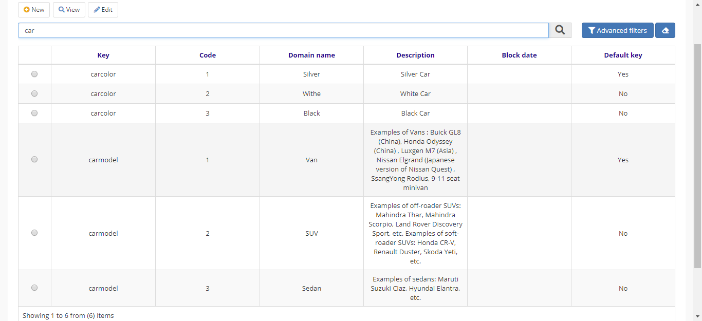
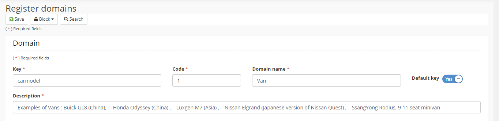

title: Domínio
Description: Domínio
# Domínio

Os Domínios permitem definir pares de chave / valor que podem ser usados em todo o sistema, mantendo a consistência das informações entre todos as aplicações Builder.

**Procedimento**

1.	Acessar a funcionalidade pelo menu de navegação Builder > Configuração > Domínio;

2.	Clicar em “Cadastrar”;

3.	Preencher os campos com as informações do novo Domínio

- **Chave** (nome de domínio) para agrupar os itens;
- **Código** para identificar exclusivamente o item de domínio);
- **Nome domínio**;
- **Descrição**.

4.	Clicar em “Salvar”.

Figura 1 - Pesquisar domínio

Figura 2 - Cadastrar domínio

!!! tip "About"

    <b>Product/Version:</b> 4biz | Helium &nbsp;&nbsp;
    <b>Updated:</b>11/03/2021
