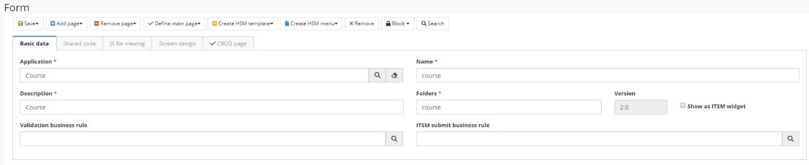

title: Formulário
Description: Formulário
# Formulário

É através do formulário que o usuário interage com a aplicação. Ele é criado combinando componentes drag and drop de interface de usuário, recursos CSS e código JavaScript e AngularJS.

## Características

- Cada formulário pode conter uma ou mais páginas e cada uma possui código HTML, um controlador AngularJS e uma coleção de dependências;

- O layout da tela é comum a todas as páginas de formulário e é construído arrastando e soltando componentes da interface do usuário;

- O layout da tela, desenhado na guia Desenho da tela, contém uma coleção de linhas, em que cada linha pode ter um ou mais componentes da interface do usuário;

- Páginas previamente configuradas no sistema:

    - **Página de CRUD** – Página configurada automaticamente pelo sistema, durante a criação do Objeto de Negócios, que fornece a funcionalidade CRUD (criar, ler, atualizar e excluir) ao Objeto de Negócios;

    - **Página padrão** - Página usada para fornecer dados do usuário durante a criação de uma solicitação de serviço do 4Biz;

    - **Página de processo** - Página usada para iniciar um Processo de Negócios do Builder;

    - **Página de tarefa** - Página que renderiza um formulário do Builder na tela de ticket de um workflow do 4Biz Tracker;

    - **Página de relatório** - Página para integração do fomrulário com os relatórios gerados pelo sistema, incluindo dependências específicas para a execução de um relatório JASPER.

## Antes de começar

É necessário ter criado a Aplicação Builder.

## Procedimento

1.	Acessar a funcionalidade pelo menu de navegação Builder > Gerenciamento > Formulário;

2.	Clicar em “Cadastrar”;

3.	Completar os campos disponíveis na aba “Identificação":

- Nome da Aplicação Builder a qual o formulário pertence
- Nome do formulário
- Descrição do formulário
- Regra de negócio de validação, se necessário
- Pasta onde as configurações do formulário serão armazenadas

    
    

    Figura 1 - Formulário

    !!! Abstract "ATENÇÃO"

        A versão é incrementada automaticamente pelo sistema sempre que uma nova versão do formulário é criada.

4. Adicionar página

    

    Figura 2 - Adicionar página
    

5. As abas geradas terão a seguinte estrutura:

    * Propriedades: dados gerais

    

    Figura 3 - Dados gerais
    

    * HTML: estrutura de página HTML

    

    Figura 4 - HTML
    

    * Controlador: código do controlador referente ao formulário

    

    Figura 5 - Controlador
    
    -    Se o formulário precisar de código externo, esse código deverá ser registrado como uma dependência. O nome da dependência, caminho em que está localizada e se deve ser injetada no controlador também deve ser informados.

    

    Figura 6 - Dependências

6. Desenhar a tela. Para criar o design da tela, clique em Editar tela ou navegue até a guia do sistema Desenhar Tela, que se abre automaticamente.
    
    - Arraste os componentes localizados na paleta do lado esquerdo e solte-os no centro da tela. Os componentes são organizados em linhas e colunas, cada linha tendo uma largura de 12 colunas.

    - Você pode criar guias para os formulários. Para fazer isso, vá para o menu da guia e escolha as guias na organização horizontal ou vertical. Arraste e solte componentes nas guias, conforme explicado acima.

    

    Figura 7 - Design

7.	Clique em Salvar para efetivar as alterações. Você pode salvá-lo na versão original (versão atual) ou em uma nova versão.

!!! Abstract "JS para teste"
    
    Nessa guia, é possível incluir variáveis para testar o código JavaScript do controlador. Mais informações podem ser encontradas em Desenvolvendo aplicativos.

!!! tip "About"

    <b>Product/Version:</b> 4biz | Helium &nbsp;&nbsp;
    <b>Updated:</b>11/03/2021 

